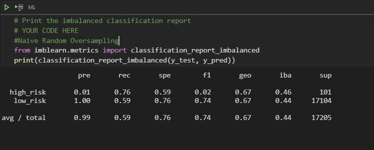
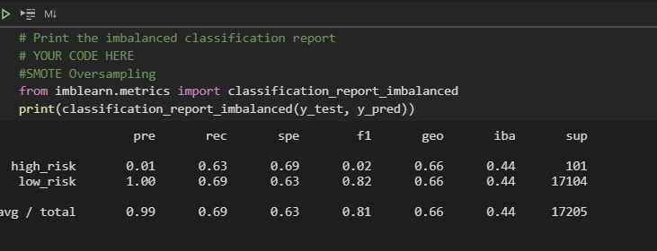
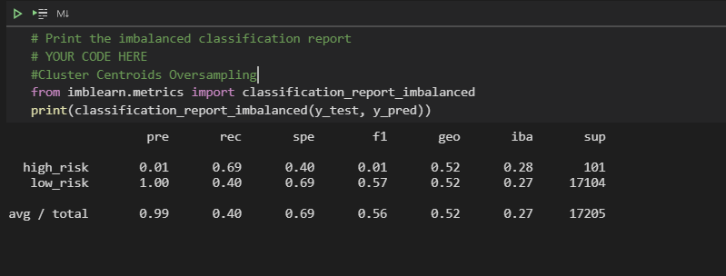
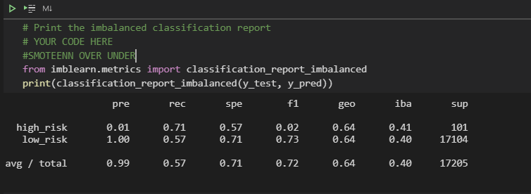
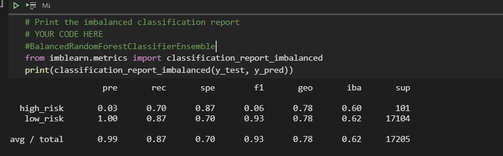
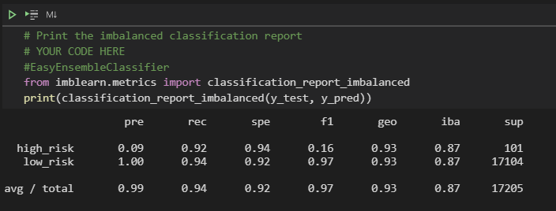

# Credit Risk Analysis
## Overview:
To use different algorithms to train and evaluate credit card risk with unbalanced classification problem.

## Results:
Evaluated six models:

Naive Random Oversampling
* high_risk pre(0.01), rec(0.76), f1(0.02)
* low_risk pre(1.00), rec(0.59), f1(0.74). 
Not a good model for predicting high_risk because the f1 score shows a very low number( low precision is indicative of a large number of false positives)

_____________________________________________________________________________________________________________

SMOTE Oversampling
* high_risk pre(0.01), rec(0.63), f1(0.02)
* low_risk pre(1.00), rec(0.69), f1(0.82). 
Not a good model for predicting high_risk because the f1 score shows a very low number( low precision is indicative of a large number of false positives)

_____________________________________________________________________________________________________________

Cluster Centroids Oversampling
* high_risk pre(0.01), rec(0.69), f1(0.01)
* low_risk pre(1.00), rec(0.40), f1(0.57).
Not a good model for predicting high_risk because the f1 score shows a very low number( low precision is indicative of a large number of false positives)

_____________________________________________________________________________________________________________

SMOTEENN OVER/UNDER
* high_risk pre(0.01), rec(0.71), f1(0.02)
* low_risk pre(1.00), rec(0.57), f1(0.73).
Not a good model for predicting high_risk because the f1 score shows a very low number( low precision is indicative of a large number of false positives)

_____________________________________________________________________________________________________________

Blanced Random Forest Classifier Ensemble
* high_risk pre(0.03), rec(0.70), f1(0.06)
* low_risk pre (1.00), rec(0.87), f1(.93)
Not a good model for predicting high_risk because the f1 score shows a very low number( low precision is indicative of a large number of false positives)

_____________________________________________________________________________________________________________

Easy Ensemble Classifier
* high_risk pre(0.09), rec(0.92), f1(0.16)
* low_risk pre(1.00), rec(0.94), f1(.97)
Not a good model for predicting high_risk because the f1 score shows a very low number( low precision is indicative of a large number of false positives)

## Summary
None of the algorithms were very useful in predicting the high risk credit cards because of the low precision score, however the Easy Ensemble Clasiffier might be useful  because of the high recall of .92 which shows a low number of false negetives depending on the thresholds set by the credit card company for the summary scores. 
